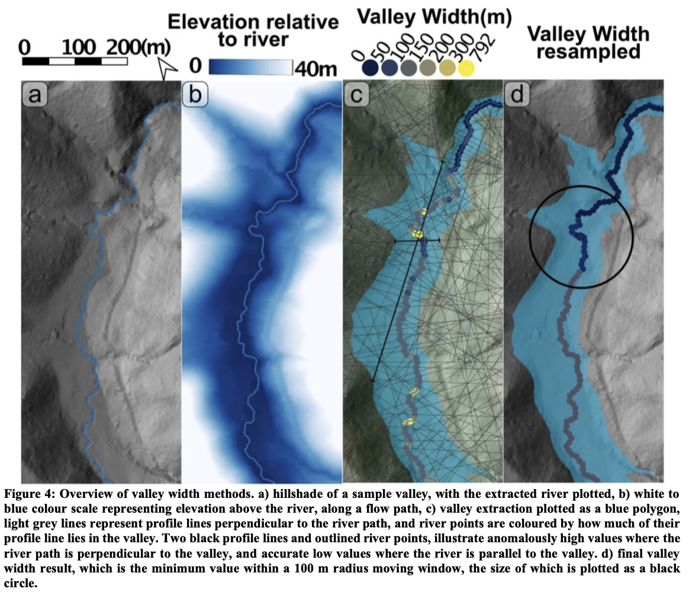

# pyValleyWidth
Codes developoed on pytopotoolbox (https://github.com/TopoToolbox/pytopotoolbox) framework to extract river valley width from digital elevation model data.

The functions were trainslated from Paul Morgan's codes (https://github.com/PMonroeMorgan/ElevationThresholdValleyWidth) originally developed on the MATLAB version of Topotoolbox 2 ([https://github.com/wschwanghart/topotoolbox?tab=readme-ov-file](https://github.com/wschwanghart/topotoolbox.git)) software framework. If you use this code in your work, please cite Paul Morgan's paper that is currently under review: 

Morgan, P. M., Grant, A., Struble, W., LaHusen, S., and Duvall, A.: The damability function: A probabilistic approach to regional landslide dam susceptibility analysis applied to the Oregon Coast Range, USA, EGUsphere [preprint], https://doi.org/10.5194/egusphere-2025-580, 2025.

Below is the method overview, captured from Morgan et al. (in review) preprint.

